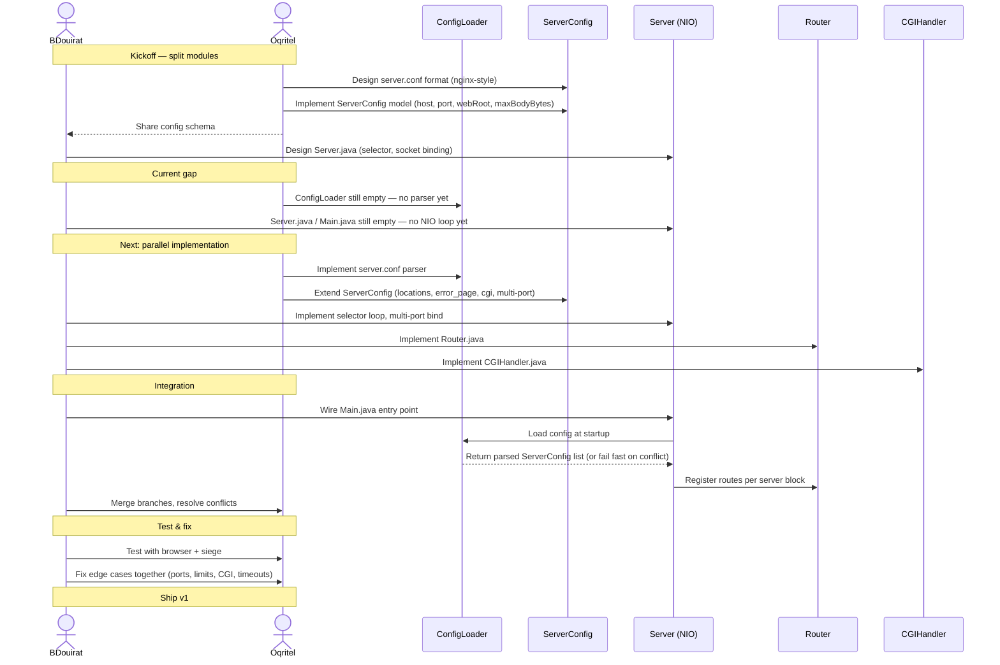

# LocalServer — team workflow sequence

Based on current state: `server.conf` (nginx-style, not JSON) and `ServerConfig.java` exist,
`ConfigLoader.java` and `Main.java` are still empty stubs.

```mermaid
sequenceDiagram
    actor B as BDouirat
    actor O as Oqritel
    participant CFG as ConfigLoader
    participant SC as ServerConfig
    participant SRV as Server (NIO)
    participant RT as Router
    participant CGI as CGIHandler

    Note over B,O: Kickoff — split modules
    O->>SC: Design server.conf format (nginx-style)
    O->>SC: Implement ServerConfig model (host, port, webRoot, maxBodyBytes)
    O-->>B: Share config schema
    B->>SRV: Design Server.java (selector, socket binding)

    Note over B,O: Current gap
    O->>CFG: ConfigLoader still empty — no parser yet
    B->>SRV: Server.java / Main.java still empty — no NIO loop yet

    Note over B,O: Next: parallel implementation
    O->>CFG: Implement server.conf parser
    O->>SC: Extend ServerConfig (locations, error_page, cgi, multi-port)
    B->>SRV: Implement selector loop, multi-port bind
    B->>RT: Implement Router.java
    B->>CGI: Implement CGIHandler.java

    Note over B,O: Integration
    B->>SRV: Wire Main.java entry point
    SRV->>CFG: Load config at startup
    CFG-->>SRV: Return parsed ServerConfig list (or fail fast on conflict)
    SRV->>RT: Register routes per server block
    B->>O: Merge branches, resolve conflicts

    Note over B,O: Test & fix
    B->>O: Test with browser + siege
    B->>O: Fix edge cases together (ports, limits, CGI, timeouts)

    Note over B,O: Ship v1
```
