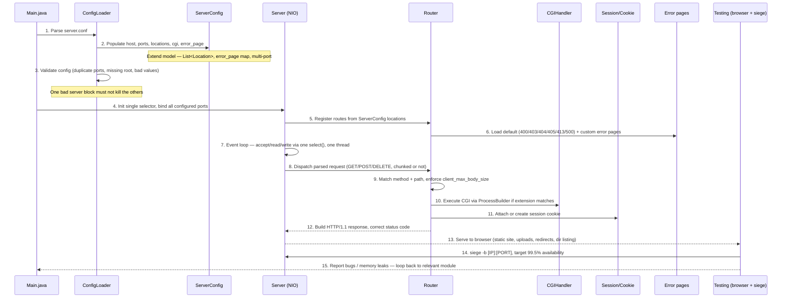

# LocalServer — full task sequence (implementation order)

This is the technical build order the project needs, regardless of who does what —
use it to see what blocks what.

**Blocking dependencies to note:**
- Router, CGIHandler, and error pages can't be tested end-to-end until `ConfigLoader` and `Main.java` exist.
- Multi-port binding in `Server.java` depends on `ServerConfig` supporting more than one port per config block.
- Sessions/cookies and directory listing are independent of the above and can be built in parallel.
